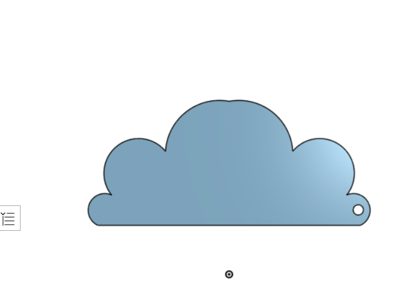

# Cloud-Keychain-3D-Model
A 3D CAD modeling project created in Onshape that designs a cloud-shaped keychain. The project demonstrates the fundamentals of sketching, geometric constraints, mirror, extrusion.

## Overview
This project focuses on designing a cloud-shaped keychain using Onshape. The model was created by sketching the cloud profile, applying dimensions and geometric constraints to create a fully defined sketch, and adding a circular hole for attaching a key ring.

### Onshape Project
You can view the complete CAD model here:
[https://cad.onshape.com/documents/3a24a1d6647b363b2faeef8b/w/b4012f5e62422df3b09240d6/e/f095c5bf0dc304692a5e86d7?renderMode=0&uiState=6a56f9a609729060e3e9745e](https://cad.onshape.com/documents/3a24a1d6647b363b2faeef8b/w/b4012f5e62422df3b09240d6/e/f095c5bf0dc304692a5e86d7?renderMode=0&uiState=6a56f9a609729060e3e9745e)

## Model


## Technologies Used
- Onshape
- CAD Modeling
- Sketch Tools
- Mirror Feature
- Extrude Feature

## Features
- Create a fully defined sketch.
- Apply dimensions and geometric constraints.
- Design a cloud-shaped keychain.
- Add a key ring hole.
- Convert the sketch into a 3D model using Extrude.
- Export the final design as an STL file.

## Project Files

```text
Cloud-Keychain-3D-Model/
│
├── Part Studio 1 - Part 1.stl
├── Screenshot.png
└── README.md
```

| File | Description |
|------|-------------|
| Cloud_Keychain.stl | Exported STL file of the cloud keychain |
| Output.png | Screenshot of the final 3D model |
| README.md | Project documentation |

## Design Process
1. Create the cloud sketch.
2. Apply dimensions and geometric constraints.
3. Use the Mirror feature where needed to maintain symmetry.
4. Add a circular hole for the key ring.
5. Extrude the sketch into a 3D solid.
   
## Output
- Fully defined CAD sketch.
- 3D cloud-shaped keychain.
- Key ring hole integrated into the design.
- STL file ready for 3D printing.
